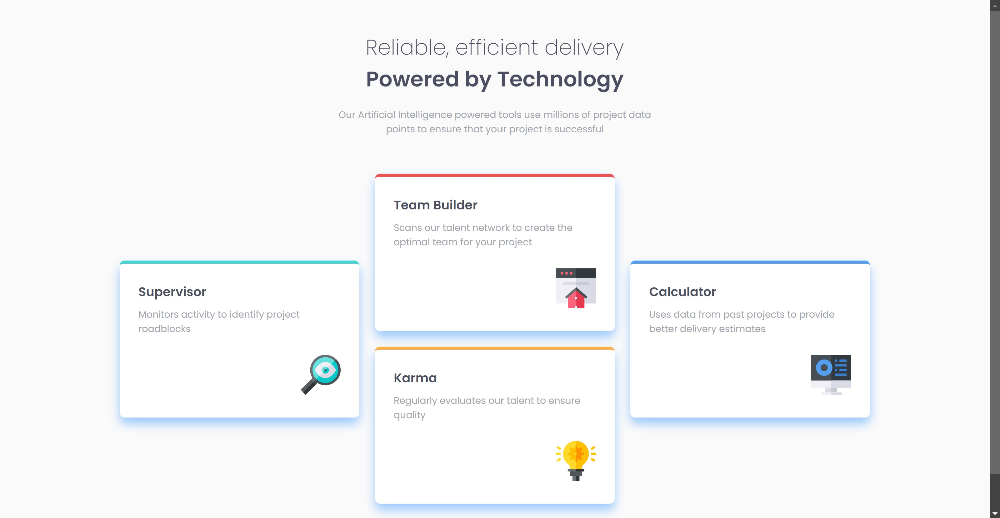
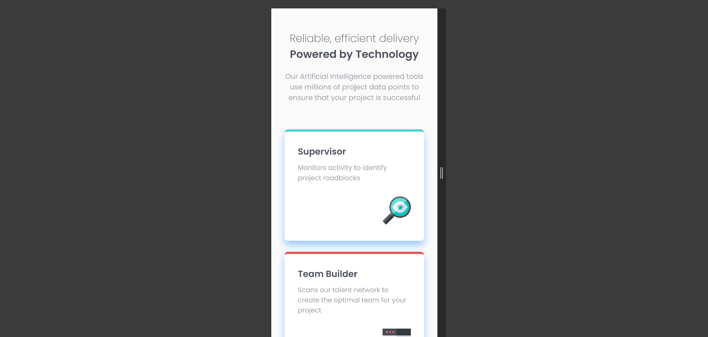

# Frontend Mentor - Four Card Feature Section Solution

This is a solution to the [Four Card Feature Section challenge on Frontend Mentor](https://www.frontendmentor.io/challenges/four-card-feature-section-weK1eFYK). Frontend Mentor challenges help you improve your coding skills by building realistic projects.

## Table of Contents

- [Overview](#overview)
  - [The Challenge](#the-challenge)
  - [Screenshot](#screenshot)
  - [Links](#links)
- [Badges](#badges)
- [My Process](#my-process)
  - [Built With](#built-with)
  - [What I Learned](#what-i-learned)
  - [Continued Development](#continued-development)
  - [Useful Resources](#useful-resources)
- [Style Guide](#style-guide)
- [Author](#author)
- [Acknowledgments](#acknowledgments)
- [License](#license)
## Overview

### The Challenge

Users should be able to:

- View the optimal layout for the site depending on their device's screen size.

### Screenshot





### Links

- **Solution URL:** [View Solution](https://www.frontendmentor.io/solutions/four-card-feature-section-bvDgD6I2an)
- **Live Site URL:** [Live Demo](https://four-card-feature-section-by-yashi.netlify.app)

## Badges

[](https://www.frontendmentor.io/challenges/four-card-feature-section-weK1eFYK)  
[](https://developer.mozilla.org/en-US/docs/Web/HTML)  
[](https://developer.mozilla.org/en-US/docs/Web/CSS)  
[](https://developer.mozilla.org/en-US/docs/Learn/CSS/CSS_layout/Mobile_first)
[](https://app.netlify.com/sites/four-card-feature-section-by-yashi/deploys)

## My Process

### Built With

Based on the provided code and your project details, here's the updated "Built With" section of the README:

- **HTML5:** Utilized semantic HTML5 elements for structuring the content.
- **CSS3:** Implemented modern CSS techniques for styling.
  - **CSS Grid:** Used for creating a responsive layout for the feature section.
  - **Flexbox:** Applied for alignment and spacing within the card container.
  - **Custom Properties (CSS Variables):** Used to manage colors and other reusable values.
- **Mobile-First Design:** Designed with a mobile-first approach to ensure responsiveness across devices.
- **Google Fonts:** Integrated [Poppins](https://fonts.google.com/specimen/Poppins) for typography.

### What I Learned

In this project, I enhanced my skills in creating responsive layouts using CSS Grid and Flexbox. A key learning point was managing different screen sizes effectively with CSS Grid, as shown in this CSS snippet:

```css
.main {
  display: grid;
  grid-template-columns: 1fr 1fr 1fr;
  gap: 25px;
}
```

This approach allowed for a clean, adaptable design across various devices.

### Continued Development

In future projects, I plan to focus more on:

- Enhancing accessibility features.
- Integrating animations for a more interactive user experience.
- Exploring advanced CSS techniques for complex layouts.

### Useful Resources

- [MDN Web Docs - CSS Grid](https://developer.mozilla.org/en-US/docs/Web/CSS/CSS_Grid_Layout) - This resource helped me understand how to effectively use CSS Grid.
- [CSS Tricks - A Complete Guide to Flexbox](https://css-tricks.com/snippets/css/a-guide-to-flexbox/) - This guide was instrumental in mastering Flexbox layouts.

## Style Guide

For the style guide refer to [Style Guide File](style-guide.md)

## Author

- **Frontend Mentor** - [@Yashi-Singh-1](https://www.frontendmentor.io/profile/Yashi-Singh-1)
- **LinkedIn** - [Yashi Singh](https://www.linkedin.com/in/yashi-singh-b4143a246)

## Acknowledgments

Special thanks to the [Frontend Mentor](https://www.frontendmentor.io/challenges) community for their support and feedback throughout this project. 

## License

By contributing to this project, you agree that your contributions will be licensed under the [MIT License](LICENSE).
